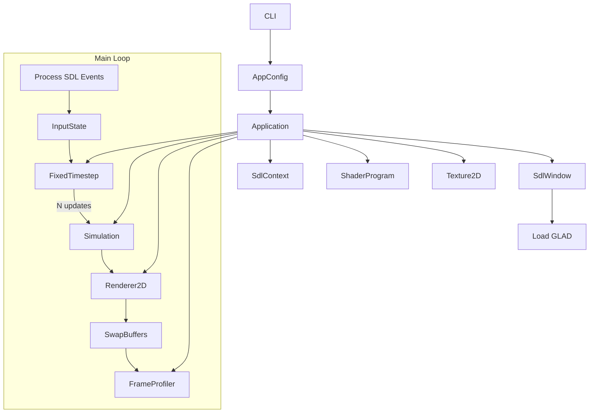
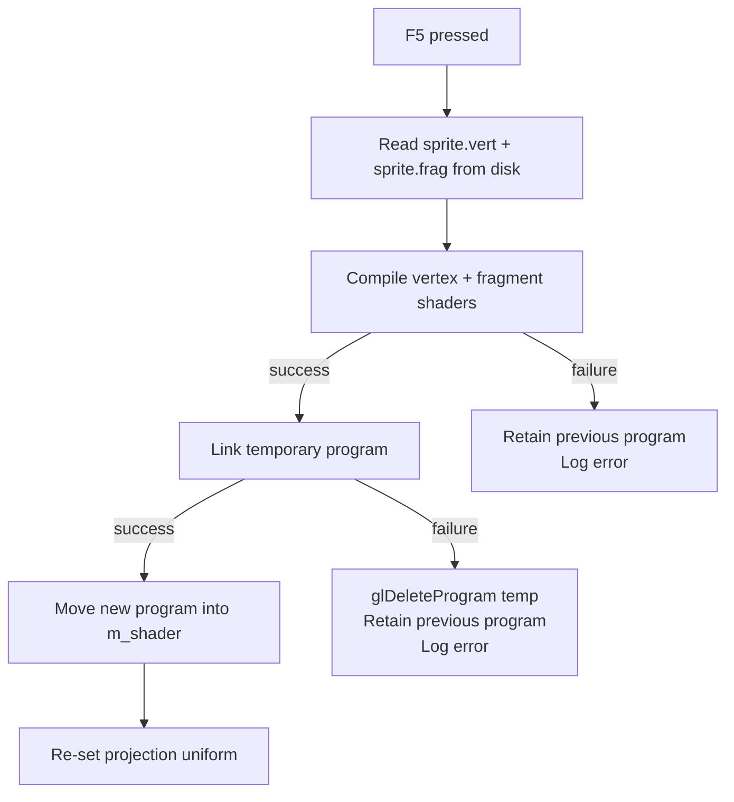

# RenderLoopLab – Architecture

## Component Responsibilities

| Component | Responsibility |
|---|---|
| `CLI` | Parse `argc/argv` into `ApplicationConfig`; print help |
| `ApplicationConfig` | Value object holding all run-time configuration |
| `Application` | Top-level orchestrator; owns all subsystems; runs the loop |
| `SdlContext` | RAII wrapper for `SDL_Init` / `SDL_Quit` |
| `SdlWindow` | Owns `SDL_Window` + `SDL_GLContext`; loads GLAD |
| `SdlInput` | Translates SDL events into abstract `InputState` |
| `InputState` | Platform-free, per-frame snapshot of abstract actions |
| `Simulation` | Deterministic CPU-only physics; no OpenGL or SDL |
| `FixedTimestep` | Clock accounting; returns update count + alpha |
| `ShaderProgram` | Compiles and links a GLSL shader program; RAII |
| `VertexBuffer` | RAII `GL_ARRAY_BUFFER` ownership |
| `IndexBuffer` | RAII `GL_ELEMENT_ARRAY_BUFFER` ownership |
| `VertexArray` | RAII VAO ownership |
| `Texture2D` | RAII 2D texture ownership |
| `Renderer2D` | Dynamic-batch sprite renderer |
| `FrameProfiler` | Measures per-phase timings; computes statistics |
| `BenchmarkReport` | Formats and writes JSON reports; prints summary |

---

## Object Lifetime

Objects are owned in strictly nested scopes to guarantee safe destruction order:

```
main()
  └── Application
        ├── SdlContext                   (SDL_Init / SDL_Quit)
        ├── SdlWindow                    (SDL_Window + SDL_GLContext)
        │     └── GLAD loaded here
        ├── ShaderProgram                (glDeleteProgram in dtor)
        ├── Texture2D                    (glDeleteTextures in dtor)
        ├── Renderer2D
        │     ├── VertexBuffer           (glDeleteBuffers in dtor)
        │     ├── IndexBuffer            (glDeleteBuffers in dtor)
        │     └── VertexArray            (glDeleteVertexArrays in dtor)
        └── Simulation                   (CPU only, no GL)
```

All OpenGL RAII wrappers (`ShaderProgram`, `Texture2D`, `VertexBuffer`,
`IndexBuffer`, `VertexArray`) are destroyed **before** `~SdlWindow()` is
called, because they are declared as members of `Application::Impl` and
`SdlWindow` is destroyed last.

### Why this ordering is critical

`glDelete*` functions require a valid, current OpenGL context to operate.
`SDL_GL_DeleteContext` (called in `~SdlWindow`) invalidates the context.
Any `glDelete*` call after that is undefined behaviour.

The member declaration order in `Application::Impl` enforces this:
C++ destroys members in **reverse declaration order**, so `SdlWindow` (declared
first) is destroyed **last**.

---

## Application Flow (Mermaid)



---

## Shader Hot-Reload Flow (Mermaid)



---

## Why Simulation Is Separated from Rendering

- **Testability**: Simulation tests require no GPU, no window, no SDL.
- **Determinism**: The simulation depends only on its seed, config, and dt.
  No wall-clock time or frame timing enters the simulation state.
- **Variable-rate rendering**: The renderer uses an interpolation alpha to
  smooth motion between fixed simulation steps without altering sim state.
- **Clarity of ownership**: Simulation and rendering have different update
  frequencies (fixed vs. every frame) and different lifetime requirements.

---

## Why OpenGL Wrappers Are Move-Only

Each `glGen*` handle is unique and must be released exactly once by
`glDelete*`. Allowing copy construction would create aliased handles — both
copies would try to delete the same GPU object, causing use-after-free.

Move semantics transfer the handle by zeroing the moved-from object (`m_id = 0`).
The destructor skips deletion when `m_id == 0`.

---

## Why Deterministic Simulation Matters

A reproducible scene with a fixed seed allows:
- **Regression testing** — identical seeds produce bit-identical sprite positions.
- **Benchmark fairness** — different benchmark runs render the same scene.
- **Debugging** — a crash can be reproduced by replaying the same seed and inputs.

Wall-clock performance measurements are inherently non-deterministic (OS
scheduling, cache effects, thermal throttling). The documentation explicitly
distinguishes deterministic scene state from non-deterministic timings.
